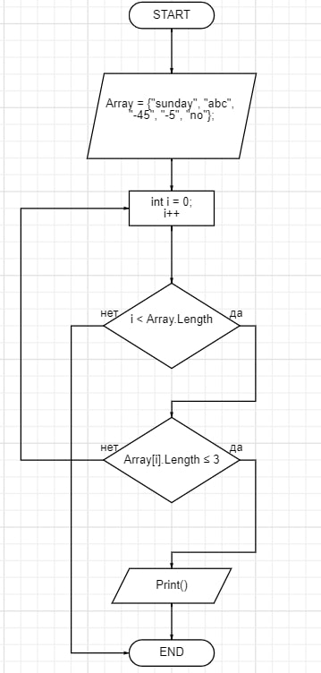

1. Создали репозиторий на GitHub
2. Нарисовали Блок-схему решения задачи 

3. Была создана программа, которая позволяет из заданного массива найти элементы в которых 3 или меньше символов.
+ Для начала была написана программа, которая позволяет вводить с клавиатуры количество элементов в массиве.
+ Затем был создан цикл, в котором мы каждый элемент задаем с клавиатуры
+ Создаем цикл, который выводит все заданные с клавиатуры значения в единый массив
+ Создаем цикл с условием, который проходит по каждому элементу массива и проверяет его на соответсвие условию. 
+ Выводим значения, соответсвующие условию на экран

Console.WriteLine("Введите желаемое количество элементов в массиве: ");
int a = int.Parse(Console.ReadLine());
string [] Array = new string [a];

for(int i = 0; i<Array.Length; i++)
{
    Array[i] = Console.ReadLine();
    
} 
Console.WriteLine("Массив: ");
for(int i =0; i<Array.Length; i++)
{
    Console.Write(Array[i] + "; ");
}
Console.WriteLine();
Console.WriteLine("Элементы массива у которых 3 или меньше символов: ");
for(int i = 0; i<Array.Length; i++)
{
    if(Array[i].Length <= 3)
    {
        Console.Write($" '{Array[i]}'; ");
    }
    
}